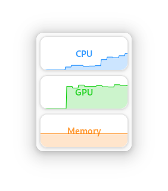
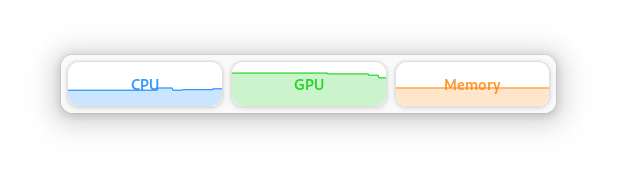

# Monitorets

**Monitorets** is a small utility application offering a simple and quick view at the usage of several of your computer resources. Almost like an applet or a widget for your Linux desktop.

Have always at a glance the usage of system resources such as CPU, memory and GPU (1):

Choose between Light or Dark theme. Or perhaps you prefer to let **Monitorets** follow your system settings. You choose:

**Monitorets** adapts automatically to the window size to offer you the best view for your systme resources:

Only keep the information relevant to you and disable the rest:

